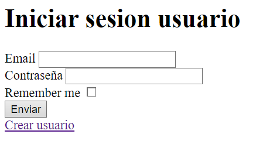
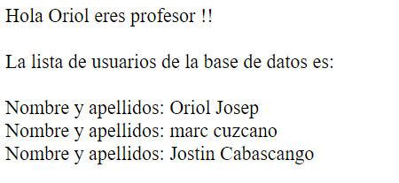
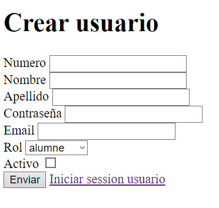
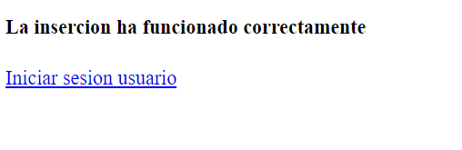

# ACTIVIDAD 5 - PHP/MYSQL - LOGIN
## Formulario de inicio de sesión de un usuario:

## El usuario tiene rol de profesor:

## El usuario tiene rol de alumno:

## Formulario creación de un usuario:

## Respuesta del formulario de creación de un usuario correctamente:

## Requisitos

- Servidor web con PHP y MySQL.
- Acceso a phpMyAdmin para la gestión de la base de datos.

## Objetivos de la actividad

* Aprender a utilizar "include".
* Utilizar funciones para estructurar el código.
* Consultar información a través de PHP en una base de datos MySQL.
* Resolución de problemas.
* Aprender Markdown.
* Aprender Git y GitHub.
* Utilizar formularios en PHP.
* Utilizar el GET y POST.

