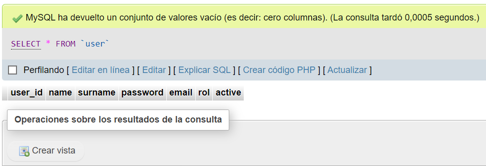
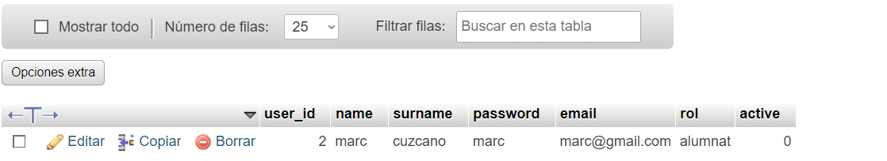
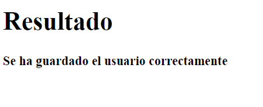

# PRACTICA 4 - ALTAS DE USUARIOS CON PHP I MYSQL

## Captura de pantalla de la BBDD a phpmyadmin ANTES de añadir datos

## Captura de pantalla de la BBDD en phpmyadmin DESPUES de añadir datos

## Forumulario

## Resultado del Formulario

## Requisitos

- Servidor web con PHP y MySQL.
- Acceso a phpMyAdmin para la gestión de la base de datos.

## Objetivos de la actividad

* Crear tablas a través de phpmyadmin.
* Insertar registros a través de php en una BBDD MySql.
* Resolución de problemas.
* Aprender markdown.
* Aprender git y github.
* Adquirir conocimiento de las RA’s indicadas.
* Utilizar formularios en php.
* *Utilizar lo GET y TABLA

