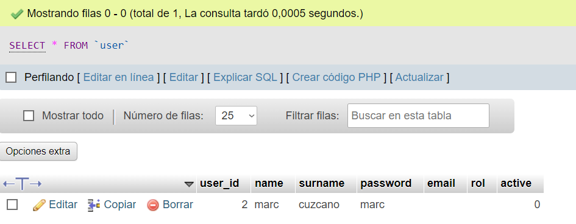
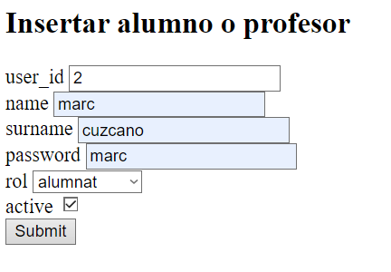
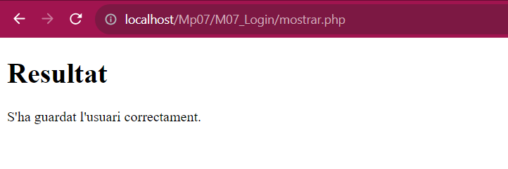

# PRÀCTICA 4 - ALTA USUARI AMB PHP I MYSQL

## Afegint captura de pantalla de la BBDD a phpmyadmin ABANS d’afegir dades

## Afegir captura de pantalla de la BBDD a phpmyadmin DESPRÉS d’afegir dades

## Forumulari

## Resultat del Formulari

