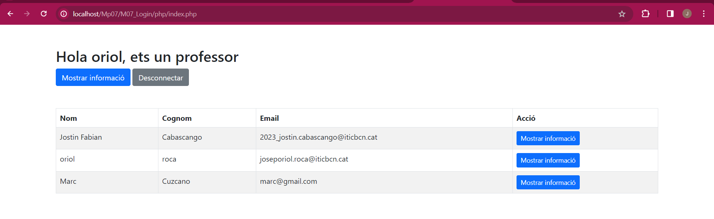

# Proyecto de Login y Registro de Usuarios con PHP y MySQL

Este proyecto es la continuación del proyecto "Alta de Usuarios con PHP y MySQL". En este proyecto, se implementa una funcionalidad adicional para permitir a los usuarios iniciar sesión en el sistema y seleccionar un idioma de preferencia mediante el uso de cookies.

## Descripción

El objetivo de este proyecto es permitir el registro y la autenticación de usuarios (estudiantes y profesores) mediante formularios PHP. Los datos se almacenan en una base de datos MySQL en una tabla llamada "users". Los formularios recopilan información importante, como el nombre, apellido, contraseña, correo electrónico y rol (estudiante o profesor).

## Estructura del proyecto

El proyecto consta de tres archivos principales:

1. `login.html`: Este es el formulario de inicio de sesión que recoge el correo electrónico y la contraseña del usuario.
2. `validar.php`: Este archivo se encarga de validar las credenciales del usuario contra la base de datos.
3. `dbConf.php`: Este archivo contiene las constantes para la conexión a la base de datos.
4. `index.php`: Este archivo se encarga de mostrar la información del usuario que se encuentra en la base de datos y permite seleccionar un idioma de preferencia mediante cookies.
5. `mostrarUsuario.php`: Este archivo se encarga de mostrar la información del usuario que se encuentra en la base de datos.
6. `idioma.php`: Este archivo se encarga de almacenar el idioma seleccionado por el usuario en una cookie.'

## Selección de Idioma con Cookies

El archivo `index.php` ha sido mejorado para permitir a los usuarios seleccionar un idioma de preferencia. Se han agregado cuatro enlaces en la parte superior de la página: "Cat" (catalán), "Es" (español), "Eng" (inglés) y "Eliminar" (para eliminar las cookies).

- Al seleccionar un idioma, se mostrará el contenido de la página en ese idioma.
- El idioma seleccionado se resaltará en color verde.
- Al hacer clic en "Eliminar", se eliminarán las cookies y la página volverá al idioma por defecto.

## Capturas de pantalla

### Ejemplo de un usuario cuyo rol es profesor:

### Ejemplo de un usuario cuyo rol es alumno:

### Ejemplo de la descripción de un usuario:

### Ejemplo de la URL cuando se pasa el ID del usuario a través del método GET:

### Ejemplo del perfil del profesor en inglés:

### Ejemplo del perfil del alumno (predeterminado en catalán):

### Ejemplo del perfil del alumno en inglés:

### Ejemplo de la descripción de un usuario en inglés:

## Cómo usar

1. Abre el archivo `templates/login.html` en tu navegador.
2. Introduce el correo electrónico y la contraseña del usuario en el formulario de inicio de sesión.
3. Haz clic en "Enviar".
4. Si las credenciales son correctas, se redirige al usuario a la página correspondiente según su rol (estudiante o profesor).
5. Si las credenciales son incorrectas, se redirige al usuario a la página de inicio de sesión y se muestra un mensaje de error.
6. En la página correspondiente según el rol, se muestra un saludo con el nombre y el rol del usuario, y se ofrecen dos enlaces: uno para mostrar la información detallada del usuario y otro para desconectarse.
7. Si haces clic en el enlace para mostrar la información detallada del usuario, se redirige al usuario a una página donde se consultan a la base de datos todos los campos del usuario. Este enlace se hace a través del método GET pasando el valor del ID del usuario.
8. Si haces clic en el enlace para desconectarse, se redirige al usuario a un archivo PHP donde se cierra la sesión. Una vez hecho esto, se redirige al usuario a la página de inicio de sesión.
9. Si el usuario selecciona un idioma de preferencia, se almacena en una cookie y se muestra el contenido de la página en ese idioma.
10. Si el usuario hace clic en "Eliminar", se eliminan las cookies y se muestra el contenido de la página en el idioma por defecto.

## Notas

Asegúrate de tener una base de datos MySQL en funcionamiento y reemplaza los valores en `dbConf.php` con tus propios valores.

Este código asume que tienes una tabla llamada `users` con las columnas `name`, `surname`, `email`, `password`, y `role`. Asegúrate de adaptar el código a tu estructura de base de datos.

## Créditos

- Autor: Jostin Fabian Cabascango Chavez
- Repositorio GitHub: [Enlace a GitHub](https://github.com/JostinCabascango)
