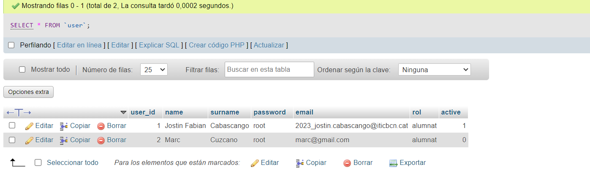

# Alta de Usuarios con PHP y MySQL

## Descripción

Este proyecto tiene como objetivo permitir el registro de usuarios (alumnado y profesorado) mediante un formulario PHP.
Los datos se almacenan en una base de datos MySQL llamada "Users" en una tabla llamada "user". El formulario recopila
información importante, como el nombre, apellido, contraseña, correo electrónico, rol (alumnat o professorat), y el
estado de activación del usuario.

## Capturas de Pantalla

- Captura de pantalla que muestra la ejecución del archivo en el explorador
  web..
  .

- Captura de pantalla de phpMyAdmin antes de agregar datos a la tabla "
  user". 

- Captura de pantalla de phpMyAdmin después de agregar datos a la tabla "
  user". .

## Requisitos

- Servidor web con PHP y MySQL.
- Acceso a phpMyAdmin para la gestión de la base de datos.

## Instalación

1. Clona este repositorio en tu servidor.
2. Crea una base de datos MySQL llamada "Users".
3. Dentro de la base de datos "Users", crea una tabla llamada "user" con los campos mencionados en la descripción.
4. Configura la conexión a la base de datos en el archivo PHP.
5. Abre el formulario en tu navegador y comienza a registrar usuarios.

## Uso

1. Abre el formulario de registro en tu navegador.
2. Completa todos los campos requeridos, seleccionando el rol y el estado de activación.
3. Envía el formulario.
4. Si se completa correctamente, se redirigirá a una página que mostrará "S'ha guardat l'usuari correctament".

## Créditos

- Autor: Jostin Fabian Cabascango Chavez
- Repositorio GitHub: [Enlace a GitHub](https://github.com/JostinCabascango)